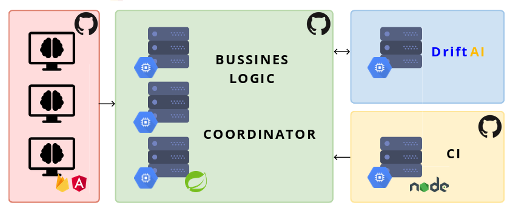

# Machine Learning CI

Machine Learning CI (MlCi) is a Platform as a Sevice (Paas) which allows you to run [DriftAI](https://github.com/Appverse/DriftAI) approaches on the cloud.

Try it out [here](https://neon-rampart-243108.firebaseapp.com)!

## How it works

In this section we describe how to use MlCi and run approaches on the cloud.

1. Create a github repository.

2. Push the files you need to run the approach and the MlCi configuration file. The configuration must be named as `ml-ci.yml`. (see repository structure example [here](https://github.com/Guillem96/housing-project)

3. Go to MlCi [web portal](https://neon-rampart-243108.firebaseapp.com/auth) an sign up using your GitHub account.

4. Click the link `Start now!`.

5. Select the repository where you've just uploaded the files

## Architecture



## Build 

### Ml Ci WebSercice

```
$ mvn package -DskipTests 
```

### Ml Ci Client

```
$ ng build -c <configuration>
```

Configurations:

- *prod*: Simulate production on local
- *cloud* Redy to run in production mode in Google Cloud 


### Ml Ci Observer

```
$ tsc --outDIR build
```

## Deploy to Google Cloud 

Being at the root of the project run:

```
$ ./gcloud-deploy.sh
```

## Modules

### Client Webapp

### Webservice (Coordinaor)

### Machine Learning module (DriftAI)

### Repository Observer